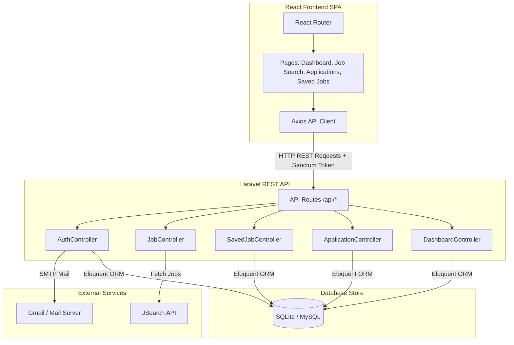
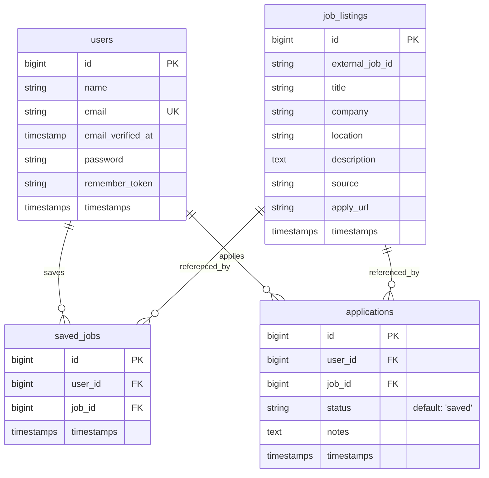

# DevTrack System Guide

Welcome to the **DevTrack System Guide**. This document outlines the architecture, database schema, core workflows, API endpoints, and setup instructions for the DevTrack platform.

---

## 1. System Architecture

DevTrack is built using a modern decoupled architecture, combining a Laravel REST API backend with a React SPA frontend.



### Components:
1. **React SPA (Vite + React 19)**: The client side handles routing, view rendering, state management, and user interaction. It communicates with the backend asynchronously using Axios.
2. **Laravel REST API (Laravel 12)**: The backend exposes stateless JSON endpoints protected by Laravel Sanctum.
3. **Database (SQLite/MySQL)**: Houses tables for users, jobs, saved job instances, and applications.
4. **JSearch API Integration**: Provides external job search listings in real-time, filtered by query parameters and location.
5. **SMTP Mail Service**: Sends transactional emails for email verification and registration welcome greetings.

---

## 2. Database Schema & Models

DevTrack's data model is defined by four core tables.

### Database Relationships
- A `User` has many `SavedJobs` and many `Applications`.
- A `Job` represents a unique job listing in the `job_listings` table.
- A `SavedJob` belongs to a `User` and references a `Job`.
- An `Application` belongs to a `User` and references a `Job` (with a workflow status tracking progress).



---

## 3. Core Workflows

### A. User Registration & Email Verification Flow
To secure registration, DevTrack implements a caching-backed email verification code system:
1. **Request Verification Code**: The user enters their email. The frontend calls `POST /api/register/send-code`. The backend generates a random 6-digit code, stores it in the Cache (with a 15-minute expiration), and sends it to the user's email via SMTP.
2. **Verify Code**: The user enters the code. The frontend calls `POST /api/register/verify-code`. The backend verifies the code matches the cache and sets a temporary cache flag (`email_verified_for_registration_{email} = true`) for 15 minutes.
3. **Complete Registration**: The user submits their name and password. The frontend calls `POST /api/register`. The backend verifies the verification cache flag exists, creates the `User` record, clears the cache keys, sends a welcome email, and returns an access token.

### B. Forgot & Reset Password Flow
1. **Send Reset Code**: The user submits their email. The backend stores a 6-digit code in the cache (`password_reset_code_{email}`) and emails it.
2. **Reset Password**: The user submits the code, email, new password, and password confirmation. The backend validates the code from cache, hashes the new password, saves it to the user record, and clears the cache key.

### C. External Job Search Integration
1. The user inputs a query and location in the frontend UI.
2. The frontend requests `GET /api/jobs/search?query=...&location=...`.
3. The backend delegates the search to `JsearchJobProvider` which calls the JSearch API.
4. Search results are formatted and returned to the frontend.
5. If the user decides to **Save** or **Apply** to a job, the backend caches or creates a record in `job_listings` with the details from JSearch, and creates a corresponding link in `saved_jobs` or `applications`.

---

## 4. API Endpoints Reference

### Public API Endpoints
| HTTP Method | Route | Description | Request Body Parameters |
|:---|:---|:---|:---|
| `POST` | `/api/register/send-code` | Generate and email verification code | `email` |
| `POST` | `/api/register/verify-code` | Verify registration code | `email`, `code` |
| `POST` | `/api/register` | Create user profile & authenticate | `name`, `email`, `password`, `password_confirmation` |
| `POST` | `/api/login` | Log in and return Sanctum Bearer token | `email`, `password` |
| `POST` | `/api/password/forgot` | Send password recovery email code | `email` |
| `POST` | `/api/password/reset` | Complete password reset | `email`, `code`, `password`, `password_confirmation` |

### Authenticated API Endpoints (Requires `Authorization: Bearer <token>`)
| HTTP Method | Route | Description | Request / Query Params |
|:---|:---|:---|:---|
| `POST` | `/api/logout` | Revoke user's current token | *None* |
| `GET` | `/api/user` | Retrieve authenticated user profile | *None* |
| `GET` | `/api/jobs/search` | Search JSearch job listings | `query`, `location` (optional) |
| `GET` | `/api/jobs/{id}` | Get specific job details | *None* |
| `GET` | `/api/saved-jobs` | List all saved jobs for user | *None* |
| `POST` | `/api/saved-jobs` | Save a job listing | `job_id` or full job object (if external) |
| `DELETE` | `/api/saved-jobs/{id}` | Remove a job from saved list | *None* |
| `GET` | `/api/applications` | List user's tracked applications | *None* |
| `POST` | `/api/applications` | Track a job application | `job_id` or full job object, `status`, `notes` |
| `PUT` | `/api/applications/{id}` | Update application status or notes | `status`, `notes` |
| `DELETE` | `/api/applications/{id}` | Delete a tracked application | *None* |
| `GET` | `/api/dashboard/stats` | Retrieve metrics for applications | *None* |

---

## 5. Frontend Architecture & Features

The React frontend utilizes a modular component layout.

### Reusable UI Elements (`/src/components`)
- **`Layout`**: Provides the structural grid including the Navbar and Sidebar.
- **`Navbar`**: Displays logo, page title, and logged-in user profile with logout action.
- **`Sidebar`**: Provides primary navigation to Dashboard, Job Search, Applications, and Saved Jobs pages.
- **`JobCard`**: Renders individual job results with quick action buttons to Save or Apply.
- **`ApplicationCard`**: Displays tracked jobs, allowing status updates (e.g. Applied, Interviewing, Offered, Rejected) and notes editing.
- **`DashboardStats`**: Displays cards with key metrics (Total Applications, Interviewing, Offers, Rejections).
- **`Modal`**: Custom popup for user confirmations and alerts, replacing native browser dialogs.

### API Service Configuration (`/src/services/api.js`)
- Uses Axios configured with base URL `http://127.0.0.1:8000/api`.
- An request interceptor automatically attaches the Sanctum Token from `localStorage` as an `Authorization: Bearer <token>` header.
- A global response interceptor watches for `401 Unauthorized` responses and automatically logs out the user and redirects to the Login screen.

---

## 6. Testing & Quality Assurance

Quality assurance is maintained through comprehensive backend feature tests.

### Running Backend Tests
DevTrack has feature tests covering auth flows, password resets, external API integrations, saved jobs, and application tracking.
Execute tests from the `devtrack-api` directory:
```bash
# Run all tests using PHPUnit
./vendor/bin/phpunit

# Or run using Laravel artisan test
php artisan test
```

### Running Frontend Lints
Analyze frontend code formatting and quality:
```bash
# Run eslint from devtrack-frontend directory
npm run lint
```
